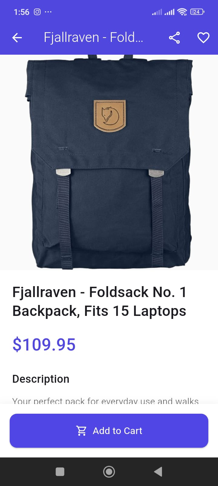

# fake_store_app

A Flutter e-commerce demo app for learning and testing purposes. Users can browse products, view product details, add items to the cart, and simulate checkout.

---

## 📦 Features

- Product listing with images, titles, and prices
- Product detail screen with description and quantity selector
- Add products to cart
- Cart screen:
    - View cart items
    - Increase/decrease quantity
    - Remove items
    - View subtotal, tax, shipping, and total
- Checkout simulation (clears cart and shows confirmation)
- Continue shopping button navigates back to product list
- Snackbars for actions (item added, removed, checkout success)
- Error handling for image loading

---

## 🚀 Getting Started

### Prerequisites

- Flutter SDK installed ([Installation guide](https://flutter.dev/docs/get-started/install))
- Dart >= 3.0
- Android Studio or VS Code
- Git

### Installation

1. Clone the repo:

```bash
git clone https://github.com/I-subhan/fake_store_app.git

## 📸 Screenshots

### Product List


### Product Detail


### Profile Screen


## 📸 Screenshots

<p align="center">
  
  
  
</p>
